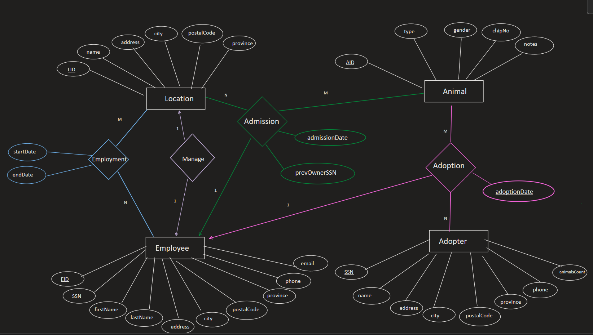

# Humane Society Database Management System

## Overview

This project implements a relational database for a Humane Society Organization (HSO) responsible for managing animals, employees, adopters, admissions, adoptions, and shelter locations.

The database was designed from business requirements and modeled using an Entity Relationship Diagram (ERD) before being implemented in SQL. The project demonstrates core database concepts including normalization, primary and foreign key constraints, referential integrity, views, triggers, and advanced SQL querying techniques.

In addition to the original database design requirements, several enhancements were added to simulate features commonly found in production systems, including automated data validation and reporting views.

---

## Project Objectives

The Humane Society database supports the following operations:

- Manage multiple shelter locations.
- Track employees and managers.
- Maintain employee employment history.
- Record animal admissions.
- Record animal adoptions.
- Store adopter information.
- Support reporting through SQL queries.
- Enforce business rules through constraints and triggers.

---

## Features

### Database Design

- Entity Relationship Diagram (ERD)
- Relational Database Schema
- Primary Keys
- Foreign Keys
- Composite Keys
- Check Constraints
- Referential Integrity

### SQL Concepts Demonstrated

- Multi-Table Joins
- Aggregate Functions
- GROUP BY
- HAVING
- Subqueries
- EXISTS
- NOT EXISTS
- Relational Division
- Data Validation
- Views
- Triggers

### Additional Enhancements

- Available Animals View
- Adoption History View
- Automatic Adopter Count Updates
- Adoption Date Validation

---

## Database Entities

### Employee

Stores information about HSO employees.

Attributes include:

- Employee ID (EID)
- SSN
- First Name
- Last Name
- Address
- City
- Postal Code
- Province
- Phone
- Email

---

### Location

Stores information about Humane Society locations.

Attributes include:

- Location ID (LID)
- Name
- Address
- City
- Postal Code
- Province

---

### Animal

Stores information about animals admitted to the organization.

Attributes include:

- Animal ID (AID)
- Type
- Gender
- Chip Number
- Notes

---

### Adopter

Stores information about adopters.

Attributes include:

- SSN
- Name
- Address
- City
- Postal Code
- Province
- Phone
- Animal Count

---

## Relationship Entities

### Employment

Tracks employee work history.

An employee may:

- Work at multiple locations.
- Leave and return to a location multiple times.

Attributes:

- Start Date
- End Date

---

### Manage

Tracks location managers.

Business Rules:

- Each location has one manager.
- A manager can manage only one location.

---

### Admission

Records animal admissions.

Attributes:

- Admission Date
- Previous Owner SSN

Tracks:

- Animal admitted
- Employee processing the admission
- Location receiving the animal

---

### Adoption

Records animal adoption events.

Attributes:

- Adoption Date

Tracks:

- Animal adopted
- Adopter
- Employee processing the adoption

---

## Entity Relationship Diagram

The conceptual design of the database is shown below:

```text
ERD.png
```


The ERD includes:

- Entities
- Attributes
- Primary Keys
- Relationship Attributes
- Cardinality Constraints

---

## Views

### AvailableAnimals

Returns animals that currently have no adoption record.

```sql
SELECT *
FROM AvailableAnimals;
```

Purpose:

- Quickly identify animals available for adoption.
- Simplify reporting queries.

---

### AdoptionHistory

Provides a consolidated view of adoption activity.

Information provided:

- Animal ID
- Animal Type
- Adopter Name
- Adoption Date
- Employee Who Processed the Adoption

Example:

```sql
SELECT *
FROM AdoptionHistory;
```

Purpose:

- Management reporting.
- Adoption tracking.
- Historical analysis.

---

## Triggers

### trg_incrementAnimalCount

Automatically updates the adopter's animal count whenever a new adoption is recorded.

Business Rule:

```text
When an adoption occurs,
the adopter's animalsCount should increase by 1.
```

---

### trg_checkAdoptionDate

Validates adoption dates before insertion.

Business Rule:

```text
An animal cannot be adopted before it has been admitted.
```

Example:

```sql
ERROR:
Adoption date cannot be earlier than admission date
```

---

## Query Library

The project contains a collection of SQL queries based on assignment requirements and additional reporting use cases.

### Assignment 2 Queries

#### Query A

List employees living in Laval.

Concepts:

- Filtering
- Selection

---

#### Query B

Count animals admitted by each employee at each location.

Concepts:

- Joins
- GROUP BY
- COUNT

---

#### Query C

Display Roger McDonald's employment history.

Concepts:

- Sorting
- Multi-Table Joins

---

#### Query D

Find manager contact information related to a specific adoption issue.

Concepts:

- Multi-Table Joins
- Relationship Navigation

---

### Assignment 4 Queries

#### Query A

Animals adopted within a given date range.

Concepts:

- Date Filtering
- Joins

---

#### Query B

Animals adopted by at least three different adopters.

Concepts:

- GROUP BY
- HAVING
- COUNT(DISTINCT)

---

#### Query C

Adopters who adopted animals from locations in provinces different from their own.

Concepts:

- Comparisons
- Multi-Table Joins

---

#### Query D

Adopters who adopted only female animals.

Concepts:

- NOT EXISTS
- Set Logic

---

#### Query E

Adopters who adopted all animal types.

Concepts:

- Relational Division
- Double NOT EXISTS

---

## Project Structure

```text
humane-society-database/
│
├── README.md
├── ERD.png
│
└── sql/
    ├── 01_create_schema.sql
    ├── 02_insert_sample_data.sql
    ├── 03_queries.sql
    └── 04_demo_and_tests.sql
```

---

## Installation
## Installation

### Prerequisites

To run this project, you will need:

- MySQL 8.0+ (recommended)
- MySQL Workbench or another SQL client

---

### Step 1: Create the Database

```sql
CREATE DATABASE HumaneSocietyDB;
USE HumaneSocietyDB;
```

---

### Step 2: Create the Schema

Execute:

```sql
SOURCE 01_create_schema.sql;
```

This script creates:

- Tables
- Primary Keys
- Foreign Keys
- Check Constraints
- Views
- Triggers

---

### Step 3: Load Sample Data

Execute:

```sql
SOURCE 02_insert_sample_data.sql;
```

This script populates the database with sample:

- Employees
- Locations
- Animals
- Adopters
- Admissions
- Adoptions

---

### Step 4: Run Queries

Execute:

```sql
SOURCE 03_queries.sql;
```

This script contains all required assignment queries as well as additional reporting queries.

---

### Step 5: Run Demonstrations and Tests

Execute:

```sql
SOURCE 04_demo_and_tests.sql;
```

This script demonstrates:

- AvailableAnimals View
- AdoptionHistory View
- Animal Count Trigger
- Adoption Date Validation Trigger

---

## Sample Outputs

### Available Animals

```sql
SELECT *
FROM AvailableAnimals;
```

Example Output:

| AID | Type | Gender |
|------|------|---------|
| 205 | Cat | Female |
| 210 | Rabbit | Female |
| 211 | Dog | Male |

---

### Adoption History

```sql
SELECT *
FROM AdoptionHistory;
```

Example Output:

| AID | Type | Adopter Name | Adoption Date | Processed By |
|------|------|-------------|-------------|-------------|
| 201 | Dog | Alfred Simpson | 2021-01-05 | Emma Brown |
| 202 | Cat | Mary Green | 2021-02-10 | Sarah Johnson |

---

## Design Decisions

### Employment History

Employment is modeled as a relationship with attributes:

- Start Date
- End Date

This allows:

- Employees to work at multiple locations over time.
- Employees to leave and later return to a location.
- Historical employment records to be preserved.

---

### Management Assignments

The Manage relationship enforces the following business rules:

- Each location has exactly one manager.
- A manager may manage only one location.

This is enforced using:

```sql
PRIMARY KEY (EID)
UNIQUE (LID)
```

---

### Admission Records

The Admission table uses:

```sql
PRIMARY KEY (AID, admissionDate)
```

An animal may be admitted multiple times throughout its lifetime, but an animal cannot have more than one admission on the same date.

---

### Adoption Records

The Adoption table uses:

```sql
PRIMARY KEY (AID, adopterSSN)
```

This prevents the same adopter from adopting the same animal more than once while still permitting historical adoption records involving different adopters.

---

### Animal Notes

An optional notes field was added to the Animal entity.

Examples include:

- Medical conditions
- Vaccination information
- Behavioral observations
- Special adoption requirements

Example:

```text
"German Shepherd, Vaccinated"
"Requires Special Diet"
"Senior Dog"
```

---

## Additional Features Added

The original requirements focused primarily on database design and SQL queries.

To further demonstrate SQL skills, the following enhancements were added.

### Views

#### AvailableAnimals

Reports animals available for adoption.

#### AdoptionHistory

Provides a simplified reporting layer for adoption activity.

---

### Triggers

#### Adoption Count Trigger

Automatically updates the number of animals owned by an adopter whenever a new adoption is recorded.

#### Adoption Validation Trigger

Prevents invalid adoption records where an adoption date occurs before the animal's admission date.

---

## Future Improvements

Several enhancements have been identified that would make the system more suitable for production use.

### Animal Returns

Currently the system tracks:

- Admissions
- Adoptions

A future version could also track:

- Animal returns
- Re-admissions
- Re-adoptions

This would allow more accurate availability reporting.

---

### Management History

The current design stores only the current manager of each location.

A future enhancement could add:

- Manager Start Date
- Manager End Date

This would support historical reporting and auditing.

---

### Adoption Locations

The original specification does not explicitly store the location where an adoption occurred.

A future version could store:

```sql
LID
```

directly in the Adoption table to simplify reporting and improve accuracy.

---

### Animal Type Lookup Table

Animal types are currently implemented using an ENUM.

A production system would likely normalize this into a lookup table:

```text
AnimalType
-----------
TypeID
TypeName
```

Benefits include:

- Greater flexibility
- Easier maintenance
- Improved normalization

---

### Additional Triggers

Future triggers could include:

- Audit Logging
- Change Tracking
- Automated Notifications
- Data Quality Validation

---

## Skills Demonstrated

### Database Design

- ER Modeling
- Relational Schema Design
- Normalization
- Business Rule Modeling

### SQL Development

- DDL (Data Definition Language)
- DML (Data Manipulation Language)
- Views
- Triggers
- Constraints

### Query Techniques

- INNER JOIN
- LEFT JOIN
- GROUP BY
- HAVING
- Aggregate Functions
- Subqueries
- EXISTS
- NOT EXISTS
- Relational Division

### Data Integrity

- Primary Keys
- Foreign Keys
- Composite Keys
- Referential Integrity
- Check Constraints
- Trigger-Based Validation

---

## Author

Ahmed Abdelrahman

Concordia University

Database Design and SQL Portfolio Project